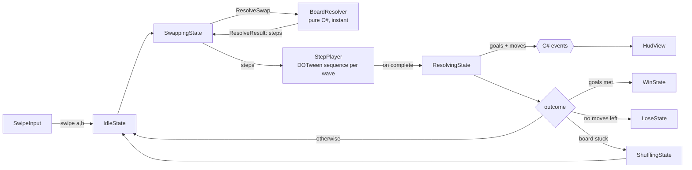

# Match-3 Prototype

A mobile match-3 game (portrait, Android) built from scratch in **Unity 6 (6000.3) and C#**.
Swipe to swap, make matches, trigger rocket and bomb specials and their combos, and reach the level goals before you run out of moves.


## Features

- Grid board, swipe-to-swap input (new Input System), match detection (3+ in a row, L/T/+ shapes), gravity, refill and cascades.
- Special tiles: a run of 4+ makes a **rocket** (clears its row or column), an L/T/+ shape makes a **bomb** (3x3). Specials set each other off in chain reactions.
- **Combos** (swap two specials): rocket + rocket = cross, rocket + bomb = 3 rows + 3 columns, bomb + bomb = 5x5.
- Levels are `ScriptableObject` assets (board size, colors, move limit, goals, seed): a new level needs no code.
- HUD with moves and goal counters, win/lose screen with Retry and Next.
- A board with no possible move is **shuffled** automatically.
- Tile views are **pooled**; tile animations are DOTween sequences.

## Architecture

The rule of the project: **the model decides, the view animates.**
Game rules live in a pure C# `Core` assembly that does not reference `UnityEngine`.
A swipe is resolved by the model instantly and returns a list of steps (swap, clear, special created, fall, spawn, shuffle).
The view only plays those steps back with DOTween; it never changes game state.



Input is ignored outside `IdleState`. The model is always ahead of the view; the view catches up.

### Code layout (`Assets/_Project/Scripts`)

| Folder | Assembly | What is in it |
|---|---|---|
| `Core/` | `Match3.Core` (no engine references) | `Board`, `Tile`, `MatchFinder`, `GravityResolver`, `Refiller`, `SpecialResolver`, `BoardResolver`, `MoveFinder`, `BoardShuffler`, `GoalTracker`, `Steps/`, `Simulation/` (balancing bots and reports) |
| `Game/` | `Match3.Runtime` | `GameStateMachine`, the states, `LevelController` (composition root), `MoveCounter`, `LevelRules` |
| `View/` | `Match3.Runtime` | `BoardView`, `TileView`, `StepPlayer`, `SwipeInput`, `UI/` (HUD, end screen) |
| `Data/` | `Match3.Runtime` | `LevelData`, `TileVisuals` (ScriptableObjects) |
| `Infrastructure/` | `Match3.Runtime` | `ObjectPool<T>`, DOTween setup |
| `Editor/` (next to `Scripts/`) | `Match3.Editor` (Editor only, never in a build) | Level Editor window, Difficulty Report, progress menu, art import settings |

Other design choices: no singletons and no `FindObjectOfType`; objects get their references through serialized fields or constructors, and talk to each other through C# events. Randomness goes through an injected `IRandom`, so a seed reproduces a board exactly.

## Run it

1. Open the project with **Unity 6000.3.25f1**.
2. Open `Assets/_Project/Scenes/Game.unity` and press Play.
3. Levels are in `Assets/_Project/Levels/`. They are listed on the `LevelController` component of the scene.

To try the specials without waiting for luck: press Play, right-click the **Level Controller** header in the Inspector and choose **Debug: Place Specials**.

## Run the tests

The model, the rules, the state machine and the balancing simulator are covered by EditMode tests (over 400).

1. In Unity open **Window > General > Test Runner**.
2. Choose the **EditMode** tab and click **Run All**.

The tests build small boards from text, for example:

```csharp
Board board = TestBoards.FromRows(
    "RGB",   // top row
    "RBG",
    "RGB");  // bottom row
```

and check matches, gravity, cascades, special creation, chain reactions, combos, move validity, goals, win/lose and the shuffle. A property test resolves many random seeds and checks that the board always ends full, with no match and with a possible move.

## Tools

Menu **Tools > Match3** (Editor only, none of this is in the Android build):

| Menu item | What it does |
|---|---|
| **Level Editor** | Edit any level of the catalog without the Inspector: size, colors, moves, seed, star numbers, goals, and a grid where you paint crates, ice and chains with the mouse. |
| **Difficulty Report** | Plays every level with two bots and writes `Docs/difficulty_report.md`. |
| Reset Progress / Unlock All Levels / Unlock Levels... | Change the saved stars so a level can be tested without playing the ones before it. |
| Play From Home | Play always starts on the Home scene. |


*(Screenshot placeholder: open the Level Editor, save a capture of the window as `Docs/level-editor.png`.)*

### Level Editor

1. Open **Tools > Match3 > Level Editor**. It finds the `LevelCatalog` itself.
2. Pick a level in the toolbar, or press **New Level** (a new asset is made and added to the end of the catalog), **Duplicate** or **Delete** (asks first, the asset goes to the trash).
3. Paint obstacles: choose a brush, then click or drag on the grid. Right mouse button erases. Row 1 is the top row. The letters are the same as in the `LevelData` text: `.` nothing, `C` crate 1 HP, `D` crate 2 HP, `I` ice 1 HP, `J` ice 2 HP, `L` chained tile.
4. Problems show in red at the top as you edit (the same checks the game uses). A cell that nothing could ever fill gets a red frame.
5. Press **Simulate** to play the level 200 times with a bot. The report shows the win rate, how many moves were left on a win, how far the goals got on a loss, a difficulty label and suggested star numbers (**Use these star numbers** writes them into the level).
6. Every change can be undone with Ctrl+Z. Press **Save** (or Ctrl+S) to write it to disk.

### The balancing simulator

`LevelSimulator` (in `Core/Simulation`, pure C#, covered by tests) plays a level many times with a bot and summarizes the runs. Two bots:

- **Random** plays any valid move. It is the lower bound: a level a person cannot win faster than this is too easy to fail.
- **Greedy** tries every valid move on a copy of the board and plays the one that advances the goals most (a rough skilled player: it sees the board but does not plan or save special tiles). A real player should land between the two.

It is deterministic: run number *i* of base seed *S* always plays the same boards, so the same level always gives the same report, and numbers can be compared before and after a change.

Difficulty label, from the greedy win rate: **Easy** above 80%, **Medium** 50-80%, **Hard** 20-50%, **Very Hard** below 20%. Suggested stars: 2 stars at the 40th percentile of moves left on a win, 3 stars at the 75th.

### Difficulty report

Run **Tools > Match3 > Difficulty Report**. It plays all levels 400 times per bot (a progress bar with Cancel shows while it runs) and writes `Docs/difficulty_report.md`: one row per level with size, colors, moves, goals, obstacles, random and greedy win rate, average moves left, rating, and current versus suggested stars. The file has no date, so running it again only changes it when a level changed.

## Performance

Tile views come from an object pool that is filled before the game starts, so playing does not call `Instantiate` or `Destroy`.
The Unity Profiler (Editor, so Editor overhead is included) shows no `Instantiate` calls during play and garbage only on swipe frames (about 6.6 KB of step lists the model creates once per move):

| Swipe frame, GC Alloc | Searching the hierarchy for `Instantiate` |
|---|---|
|  |  |

These captures are from the Editor. A capture on a phone would be the stronger proof.

## What I would do next

- Profile on a real device and shrink the per-move allocations (reuse the step lists instead of creating new ones).
- Hint system: `MoveFinder.TryFindMove` already finds a valid swap, so a "shake this pair after 5 seconds idle" hint is small.
- Real art, sound and haptics; the tile and special sprites are generated placeholders (`TileVisuals` can override them).
- Special tiles that only exist at higher levels, blockers (ice, crates) and a level select / progress save.
- Distinct visuals for each combo (today a combo reuses the effects of the two specials).
- A PlayMode test that plays a level end to end.
